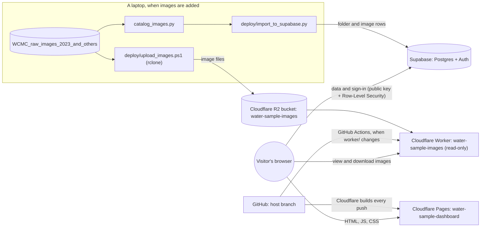

# water-sample-image-project
Organize and classify water sample images

Contributions made by @stalerico (myself), @DarbyCoder, and @chlohal

## Image catalog

`ProjectCode/catalog_images.py` scans the image dataset and outputs a CSV
manifest (one row per image, plus a folder summary) into
`ProjectCode/catalog_output/`. Magnification is assumed to be 10x for every
folder. When a raw folder has a `-pp` counterpart (same site, date, and
sample code), only the `-pp` folder is cataloged -- confirmed with the
professor that `-pp` is the city's standard post-processed output. Nothing on
disk is touched; rerunning the script just recomputes which folders are
included. `sample_code` is also classified into `capture_mode`
(`autoimage` for AI* codes, `trigger` for TR*/TM codes).

```bash
pip3 install Pillow
python3 ProjectCode/catalog_images.py
```

The manifest is gzipped for github (file limit) (`image_manifest.csv.gz`). To unzip it:

```bash
gunzip -k ProjectCode/catalog_output/image_manifest.csv.gz
```

## Hosting (Plan A)

The catalog is online at **https://water-sample-dashboard.pages.dev**. Anyone can
browse, filter, view and download the images without an account. Signing in
(Google, or email and password) is needed to label images (labeler role) and for
the admin page (admin role). Everything runs on free tiers: Cloudflare Pages,
Workers and R2, plus Supabase.

### Architecture



- **Dashboard** (`ProjectCode/index.html`, `labeling.html`, `admin.html`,
  `reset-password.html`, `privacy.html`, `404.html`, their scripts and the shared
  `base.css`, `theme.js`, `ui.js`, `viewer.js`, ... -- see
  [Look and feel](#look-and-feel) and `ProjectCode/build.mjs` for the full list):
  a static site on Cloudflare Pages. It reads
  folders, stats, charts and image lists straight from Supabase with the public
  key in `ProjectCode/config.js`. Stats and charts come from database views and
  per-folder totals, so the browser never downloads the 500K-row images table;
  a folder's image list is loaded only when that folder is opened.
- **Images**: 511,765 PNGs (3.65 GiB) in the R2 bucket `water-sample-images`.
  Each object key is the image's `relative_path` (`<folder>/<filename>`). The
  Worker in `ProjectCode/worker/` serves them read-only at
  `https://water-sample-images.watersampleimageorganization.workers.dev/<key>`;
  adding `?download=1` makes the browser save the file.
- **Database** (`ProjectCode/supabase/migrations/`): `001_init.sql` creates the
  tables `folders`, `images`, `qa_log` and `profiles`, the views behind the stats
  and charts, and the role functions; `002_labeling.sql` adds image labeling (see
  [Labeling](#labeling)). Security lives in the database (Row-Level Security and
  SQL functions), not in the page:
  - anyone can read folders, images and the QA log, and nobody can change them
    through the website, except that labelers and admins can set the `label`
    column of an image (and nothing else);
  - every account starts as `viewer`; `watersampleimageorganization@gmail.com`
    becomes `admin` on its first confirmed sign-in;
  - only admins can list accounts or change roles (admin page), and the last
    admin can never be demoted or deleted;
  - labeling is switched on by applying `002_labeling.sql`: until then the
    labeling page shows a setup notice instead of the workspace.
- **Duplicates**: `catalog_images.py` already leaves out raw folders that have a
  `-pp` twin, so the hosted data has no duplicates to hide. Folders with no
  images are hidden.
- `ProjectCode/prepare_image_data.py` is **LEGACY**: it built per-folder JSON
  files for the old local-only dashboard, which now reads from Supabase instead.

### Labeling

`labeling.html` is the labeling workspace. Anyone can browse it; accounts with the
`labeler` or `admin` role can label.

- Pick a folder from the searchable list on the left (it shows each folder's
  progress and sorts the least-labeled first), then click image tiles to select them
  (Shift-click for a range) and press a label button or its number key to label every
  selected image at once.
- Every tile also has its own label menu, and Enter or the expand button opens the
  viewer (zoom, pan, filmstrip, "label and move on") for careful one-by-one work.
- Changes appear instantly and save in the background; if a save fails the images
  are put back and a message says so. **Undo** (Z) works across everything.
- `labeled_by` and `labeled_date` are stamped by a database trigger from the signed-in
  user and the current time; the browser can write nothing but `label`.
- Progress shows as an overall ring, a per-label mix, per-folder bars (also on the
  dashboard) and, for admins, a per-labeler table on the admin page. **Export labels
  (CSV)** downloads image id, folder, filename, label and time.
- Keyboard: arrows move, Space selects, Enter opens the viewer, `1`-`6` label, `0`
  clears, `L` opens a tile's label menu, `Z` undoes, `?` lists every shortcut.

Not set up yet, or want to show it off? Add `?demo` to any page's address
(`labeling.html?demo`). Demo mode runs the whole site on sample data and generated
images with no network and no database, and nothing is saved anywhere (switch between admin, labeler, viewer and signed-out from the
pill at the bottom; `?demo=0` turns it off).

### Look and feel

The pages share one design system: `base.css` (light and dark themes as CSS
variables, typography, buttons, forms, cards, toasts, dialogs), plus
`dashboard.css`, `labeling.css` and `viewer.css` for the individual screens.

- **Light / dark mode** follows the operating system until the visitor picks one
  with the sun/moon button; `theme.js` applies it before the first paint so there is
  no flash. All colours are variables, and the palette passes WCAG AA contrast in
  both themes.
- **Fonts** are self-hosted in `ProjectCode/fonts/` (Fraunces for headings and a
  Cambria-compatible face for text, so no third-party font service is contacted).
  Cambria is used where installed.
- Icons live in one sprite (`icons.svg`); effects (drifting plankton, waves,
  confetti) in `fx.js`. Motion respects "reduce motion".

### Where secrets live

| What | Where | In git? |
|---|---|---|
| Database connection string and R2 keys | `ProjectCode/.env`, on the laptop that runs the import/upload (copy `ProjectCode/.env.example`) | No, gitignored |
| `CLOUDFLARE_API_TOKEN`, `CLOUDFLARE_ACCOUNT_ID` | GitHub repository secrets, used by the Worker deploy workflow | No |
| Google OAuth client ID and secret | Supabase dashboard (Authentication → Providers → Google) and Google Cloud Console | No |
| Supabase URL, publishable key, Worker URL | `ProjectCode/config.js` | Yes. These are public by design; what they allow is decided by Row-Level Security |

All cloud accounts belong to `watersampleimageorganization@gmail.com`.

### Adding new images (catalog → import → upload)

Run these from `ProjectCode/` in PowerShell. One-time setup on a new machine:
Python 3, Node 22+ and [rclone](https://rclone.org/), then:

```powershell
pip install Pillow -r deploy/requirements-deploy.txt
Copy-Item .env.example .env   # then fill in the real values
```

1. Put the new sample-event folders into `WCMC_raw_images_2023_and_others/`.
   Don't rename or move existing folders: an image's ID and storage key come
   from its folder and file name.
2. Rebuild the catalog (it opens every image, so expect 15–30 minutes):
   `python catalog_images.py`
3. Check, then import into Supabase. One transaction adds new rows, updates
   changed ones and removes ones no longer in the catalog. It never touches
   labels, and refuses to commit if the counts don't match.
   ```powershell
   python deploy/import_to_supabase.py --dry-run
   python deploy/import_to_supabase.py
   ```
4. Upload the images. The file list comes from the database, so import first.
   Images already in R2 are skipped, so only new ones count against the free
   write allowance. At the end it compares counts and checks 20 random images.
   ```powershell
   powershell -ExecutionPolicy Bypass -File deploy\upload_images.ps1 -DryRun
   powershell -ExecutionPolicy Bypass -File deploy\upload_images.ps1
   ```
5. Commit the regenerated `catalog_output/folder_summary.csv` and
   `catalog_output/image_manifest.csv.gz`. Nothing needs redeploying: the
   dashboard reads the live data.

Whenever a file in `supabase/migrations/` is new or changes (the first time that
includes `002_labeling.sql`), apply them all with
`python deploy/apply_migrations.py`. It is safe to re-run and checks the result.

### Deploys

- **Dashboard**: the Cloudflare Pages project `water-sample-dashboard` is
  connected to the GitHub repository and rebuilds on every push to the `host`
  branch. Build settings: root directory `ProjectCode`, build command
  `node build.mjs`, output directory `dist`. `build.mjs` copies only the web
  files, so nothing else in the repository is ever published. The Pages project
  is connected to the fork
  [DarbyCoder/water-sample-image-organization-and-analysis](https://github.com/DarbyCoder/water-sample-image-organization-and-analysis),
  so `host` must be pushed there to deploy. ("Retry deployment" in Cloudflare
  rebuilds that deployment's original commit, not the latest one.)
- **Image Worker**: `.github/workflows/deploy.yml` runs `wrangler deploy` when a
  push to `host` changes `ProjectCode/worker/`, or on demand from the Actions
  tab (Run workflow; GitHub only shows that button once the workflow file is
  also on the default branch, `main`). It needs the two Cloudflare secrets in
  the repository where it runs; GitHub also keeps Actions off on forks until
  they're enabled.
- **Database schema**: applied by hand with `deploy/apply_migrations.py` (above).

### Local development

```powershell
cd ProjectCode
python -m http.server 8000 --bind 127.0.0.1
```

Then open http://localhost:8000. The local page uses the live Supabase project
and image Worker.

- **Keep `--bind 127.0.0.1`.** Without it, anyone on the same network could
  download `ProjectCode/.env`.
- This server doesn't tell the browser when files change, so hard-reload
  (Ctrl+Shift+R) after editing.
- `http://localhost:8000/**` must stay in Supabase's Redirect URLs for sign-in
  to work locally.
- To run the Worker locally: from `ProjectCode/worker`, run `npm install`, load
  a few images into the local test bucket with
  `node scripts/seed-local.mjs "<folder>/<file.png>"`, then `npx wrangler dev`.

### Free-tier limits

| Service | Free limit | This project |
|---|---|---|
| Supabase database | 500 MB | about 168 MB |
| Supabase activity | Pauses after about 7 days with no requests | See below |
| Supabase sign-in emails | Built-in sender allows only a few emails per hour | Fine for a handful of users; add custom SMTP for more |
| Cloudflare R2 storage | 10 GB | 3.65 GB |
| R2 writes (Class A) | 1M per month | The first full upload used about 512K; later runs only upload new images |
| R2 reads (Class B) | 10M per month | One per image viewed or downloaded |
| Cloudflare Workers | 100,000 requests per day | One per image viewed or downloaded |
| Cloudflare Pages | 500 builds per month | One per push to `host` |

**If Supabase is paused**, the dashboard shows "Couldn't load the catalog
data". Sign in to supabase.com as the project account, open the project and
click **Restore project**. It takes a few minutes and keeps all data. Don't
leave it paused for months: Supabase keeps paused free projects restorable
for a limited time only.

### Known limitations

- **Scripted downloads need a User-Agent.** Cloudflare blocks Python's default
  `urllib` User-Agent (HTTP 403, error 1010). Send one, for example
  `urllib.request.Request(url, headers={"User-Agent": "Mozilla/5.0"})`.
- **"Download All Visible" is capped at 200 images per click** and saves them
  one at a time; browsers may ask to allow multiple downloads.
- **Google sign-in shows the Supabase address.** The consent screen says
  "continue to gchpxdizablwgijbgzhc.supabase.co" unless Google brand
  verification or a paid Supabase custom domain is set up. It only works for
  listed test users until the app is published in Google Auth Platform.
- **Sign-up and password-reset emails** are limited by Supabase's built-in
  email sender (see above).
- **The QA log is empty.** `catalog_images.py` no longer writes `qa_log.csv`;
  the import loads it if the file exists.
- **Some filter values are spelled inconsistently** in the source folder names
  (for example `0.1 Dilution` and `0.1 dilution`, or `1dilution` and
  `1 dilution`), so they appear as separate options.
- **The label categories are a placeholder** (cyanobacteria, diatom, other
  organism, debris, blank, unsure). Edit `ProjectCode/labels.js` once the team and
  Prof. Ahlgren settle on the real taxonomy.
- **Bulk labeling is chunked**: selections are saved 200 images per request, so a
  selection of thousands takes a moment to finish saving.
